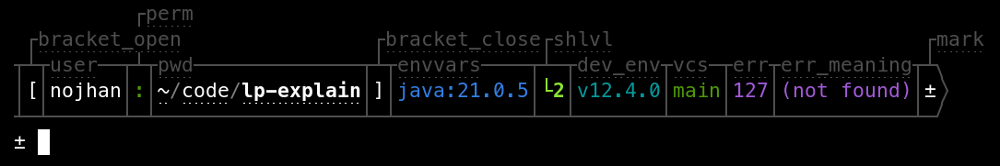

# Explain — A Liquid Prompt Theme

*Explain* is a theme for [Liquid Prompt](https://github.com/nojhan/liquidprompt).

It aims at showing the meaning of each section of the default prompt theme.
To do so it displays:

- a box around each section,
- with the name of the corresponding variable in the default theme's template,
- and it adds an hyperlink to it, so that the user can click and rapidly jump to the documentation.

## Configuration

### Color of the explanation

**LP_COLOR_EXPLAIN** *color* = 239 -1 (dark grey)

Color for everything surrounding the actual prompt sections.

### Liquid Prompt Configuration

**LP_MARK_PREFIX** *string* = $'\n'

The prefix of the duplicated prompt mark.

### Disabled Configuration

The following variables are disabled:

- LP_MARK_DEV_OPEN
- LP_MARK_DEV_CLOSE
- LP_MARK_DEV_MID
- LP_MARK_MODULES_OPEN
- LP_MARK_MODULES_SEP
- LP_MARK_MODULES_CLOSE
- LP_MARK_ENV_VARS_OPEN
- LP_MARK_ENV_VARS_SEP
- LP_MARK_ENV_VARS_CLOSE

